# Jump Space Power Grid Optimizer

A web-based tool to optimize component placement on your ship's power grid in Jump Space.

## [Launch the App Here](https://jasbanza.github.io/jump-space-power-grid-optimizer/)

---

## Features

### Grid Configuration
- **Visual Dropdowns**: Custom dropdowns with grid previews showing power cell layouts
- **Tiered Reactors & Generators**: Support for multiple tiers (Mk 1, Mk 2, etc.) with different layouts
- **Dynamic Grid Composition**:
  - Reactor (rows 1-4) + Aux Generator 1 (rows 5-6) + Aux Generator 2 (rows 7-8)
- **Protected Cells**: Blue cells indicate priority placement areas

### Build Order & Priority System
- **Priority List**: Drag-and-drop to reorder component placement priority
- **Visual Feedback**: 
  - ✅ Green border: Successfully placed
  - ❌ Red border: Could not be placed
  - 🔵 Blue border: Component is placed on at least one protected (blue) cell
  - Yellow highlight on hover (bidirectional between grid and list)

### Component Library
- **Collapsible Categories**: Organized by type (Sensors, Engines, Weapons, etc.)
- **Tier Support**: Multiple tiers per component with different shapes
- **Advanced Filters**: Filter by name, block count, and tier

### Smart Solver
- **Priority-Based Placement**: Respects your build order
- **Backtracking Algorithm**: Tries to place ALL components, falls back to partial placement if needed
- **Protected Cell Priority**: All components prefer protected (blue) cells when possible
- **Semi-Transparent Overlays**: See power cells beneath placed components

---

## Solver Algorithm

The solver uses a multi-stage approach to maximize component placement while respecting priority order.

### Flowchart

```mermaid
flowchart TD
    START([START: Solve]) --> CHECK{≤8 pieces?}
    
    CHECK -->|Yes| PHASE1[Phase 1: backtrackStrict<br/>try ALL pieces, no skipping]
    CHECK -->|No| GREEDY[Greedy placement<br/>in priority order]
    
    PHASE1 --> ALL_PLACED{All placed?}
    
    ALL_PLACED -->|Yes| DONE[✅ Return solution]
    ALL_PLACED -->|No| PHASE2[Phase 2: backtrackAllowSkip<br/>maximize placements]
    
    PHASE2 --> FOUND{Found solution?}
    FOUND -->|Yes| DONE
    FOUND -->|No| GREEDY
    
    GREEDY --> DONE

    style START fill:#2d5a27
    style DONE fill:#2d5a27
    style PHASE1 fill:#1a4a6e
    style PHASE2 fill:#4a3a1e
    style GREEDY fill:#5a2a2a
```



### Algorithm Details

#### 1. Backtracking Strategy

The solver uses **backtracking** to find valid configurations:

| Function | Purpose | Skipping Allowed? |
|----------|---------|-------------------|
| `backtrackStrict()` | Place all pieces (no skipping) | ❌ No |
| `backtrackAllowSkip()` | Place pieces, skip if needed | ✅ Yes |

#### 2. Placement Priority

For each piece, valid placements are sorted by:
- **Protected cell coverage** (highest first) - ALL components prefer blue cells

#### 3. Three-Phase Approach

1. **Phase 1**: Try to place ALL pieces using `backtrackStrict()` (no skipping)
2. **Phase 2**: If Phase 1 fails, use `backtrackAllowSkip()` to maximize placements
3. **Fallback**: If backtracking times out, use greedy placement in priority order

This ensures the solver **always tries to place everything first** before giving up on any piece.

#### 4. Limits & Performance

| Limit | Value | Purpose |
|-------|-------|---------|
| `MAX_BACKTRACK_ITERATIONS` | 50,000 | Prevents browser freeze |
| `MAX_PIECES_FOR_BACKTRACK` | 8 | Limits exponential blowup |
| Placements per piece | 15-20 | Reduces search space |

#### 5. Visual Indicators

After solving:
- ✅ **Green border**: Successfully placed
- ❌ **Red border**: Could not be placed  
- 🔵 **Blue border**: Component is placed on at least one protected (blue) cell

## Usage

1. **Configure your grid**
   - Select a reactor from the dropdown (left of rows 1-4)
   - Optionally add aux generators (rows 5-6 and 7-8)

2. **Add components to Build Order**
   - Expand categories and set quantities for each tier
   - Components automatically appear in the priority list

3. **Organize priority**
   - Drag components to reorder placement priority
   - Higher priority items are placed first

4. **Solve**
   - Click Solve - the optimizer places components in priority order
   - Hover over placed shapes on the grid OR list items for yellow highlighting

---

## Contributing

**Help us build the component library with accurate game data!**

### Quick Links
- [Edit Components](https://github.com/jasbanza/jump-space-power-grid-optimizer/edit/main/data/components.json)
- [Edit Reactors](https://github.com/jasbanza/jump-space-power-grid-optimizer/edit/main/data/reactors.json)
- [Edit Aux Generators](https://github.com/jasbanza/jump-space-power-grid-optimizer/edit/main/data/auxGenerators.json)

### How to Contribute

1. **Fork this repository**
2. **Edit the JSON files** (see formats below)
3. **Submit a Pull Request**

### Adding Component Shapes

Edit `data/components.json`:

```json
{
  "componentId": {
    "id": "componentId",
    "name": "Component Name",
    "category": "CATEGORY NAME",
    "tiers": {
      "1": {
        "shape": [
          [1, 0],
          [1, 1]
        ]
      },
      "2": {
        "shape": [
          [1, 0, 0],
          [1, 0, 0],
          [1, 1, 1]
        ]
      }
    }
  }
}
```

**Categories:** SENSORS, ENGINES, PILOT CANNONS, MULTI-TURRET SYSTEMS, SPECIAL WEAPONS

### Adding Reactors (8x4 grids)

Edit `data/reactors.json` - now supports tiers:

```json
{
  "reactorId": {
    "id": "reactorId",
    "name": "Reactor Name",
    "category": "REACTORS",
    "tiers": {
      "1": {
        "powerGeneration": 22,
        "protectedPower": 8,
        "unprotectedPower": 14,
        "grid": [
          [2, 2, 0, 0, 0, 0, 2, 2],
          [1, 2, 1, 0, 0, 1, 2, 1],
          [1, 1, 1, 0, 0, 1, 1, 1],
          [1, 1, 1, 0, 0, 1, 1, 1]
        ]
      },
      "2": {
        "powerGeneration": 26,
        "protectedPower": 10,
        "unprotectedPower": 16,
        "grid": [...]
      }
    }
  }
}
```

### Adding Aux Generators (8x2 grids)

Edit `data/auxGenerators.json` - now supports tiers:

```json
{
  "auxId": {
    "id": "auxId",
    "name": "Aux Generator Name",
    "category": "AUX GENERATORS",
    "tiers": {
      "1": {
        "powerGeneration": 10,
        "protectedPower": 4,
        "unprotectedPower": 6,
        "grid": [
          [0, 2, 1, 1, 1, 1, 2, 0],
          [0, 2, 1, 1, 1, 1, 2, 0]
        ]
      }
    }
  }
}
```

**Grid values:** `0` = unpowered, `1` = powered (green), `2` = protected (blue)

---

## Layout

```
+------------------+   +--------------+   +----------------+
|   POWER GRID     |   |  BUILD ORDER |   |   COMPONENTS   |
|                  |   |              |   |                |
| [Reactor ▼]      |   | ≡ Comp 1  ☑  |   | ▶ SENSORS (3)  |
| ████████████     |   | ≡ Comp 2  ☐  |   | ▶ ENGINES (4)  |
| ████████████     |   | ≡ Comp 3  ☐  |   | ▼ WEAPONS (5)  |
| ████████████     |   |              |   |   ├ Weapon A   |
| [Aux 1 ▼]        |   | [  SOLVE  ]  |   |   └ Weapon B   |
| ████████████     |   |              |   |                |
| [Aux 2 ▼]        |   | Status msg   |   | [Filters]      |
| ████████████     |   +--------------+   +----------------+
+------------------+
```

## Project Structure

```
├── index.html            # Main page
├── css/
│   └── styles.css        # Styling (dark theme, 3-column layout)
├── data/
│   ├── components.json   # Component shapes by category/tier
│   ├── reactors.json     # Reactor grid layouts (8x4) with tiers
│   └── auxGenerators.json # Aux generator layouts (8x2) with tiers
├── js/
│   ├── main.js           # App initialization
│   ├── grid.js           # Grid state management
│   ├── components.js     # Component loader & utilities
│   ├── templates.js      # Reactor/aux loader with tier support
│   ├── solver.js         # Priority-based backtracking solver
│   └── ui.js             # UI rendering, drag-drop, hover sync
├── GAME_RULES.md         # Game mechanics documentation
└── README.md             # This file
```

## License

MIT
